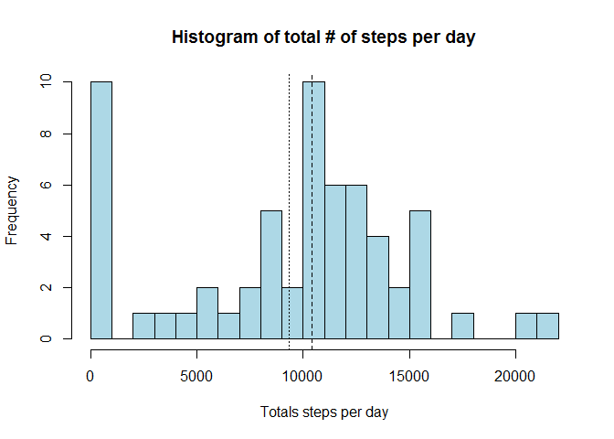
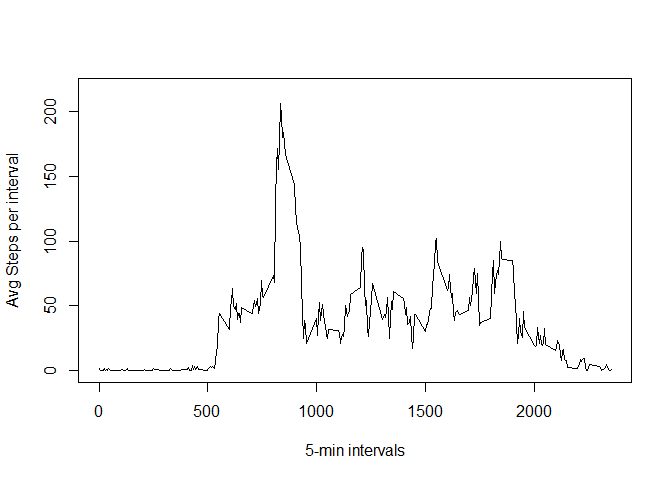
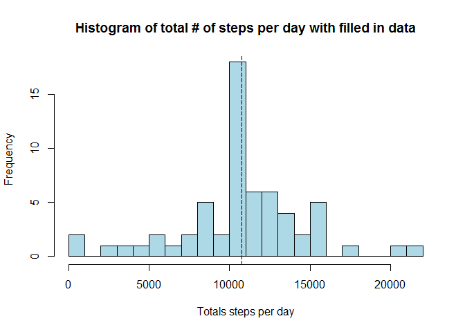
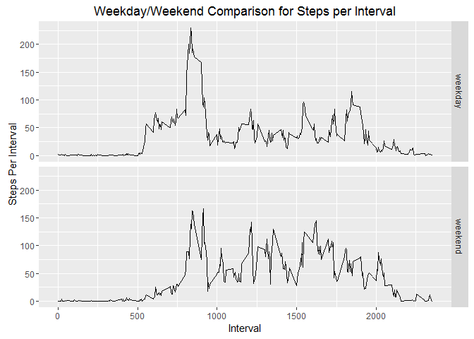

# Project 1 Assignment
Prabhakar Thanikasalam  
Tuesday, March 29, 2016  
### Course Project 1 for Reproducible research course in DS specialization


```
## Warning: package 'dplyr' was built under R version 3.2.2
```

```
## 
## Attaching package: 'dplyr'
```

```
## The following objects are masked from 'package:stats':
## 
##     filter, lag
```

```
## The following objects are masked from 'package:base':
## 
##     intersect, setdiff, setequal, union
```

```
## Warning: package 'ggplot2' was built under R version 3.2.4
```

```
## Warning: package 'knitr' was built under R version 3.2.4
```


```r
ac = read.csv("activity.csv") # the data file is assumed to be in the same folder as current working directory

ac$date = as.Date(ac$date, "%Y-%m-%d") # converting date column to date class

#Calculate the total number of steps taken per day
stepsbyday =  group_by(ac, date) %>% summarize(stepsperday = sum(steps, na.rm=T))

#Make a histogram of the total number of steps taken each day, ablines show mean, median
hist(stepsbyday$stepsperday, breaks=20, xlab="Totals steps per day", main="Histogram of total # of steps per day", col= "lightblue")
abline(v=median(stepsbyday$stepsperday), lwd=1, lty=2)
abline(v=mean(stepsbyday$stepsperday), lwd=1, lty=3)
```



```r
#Calculate and report the mean and median of the total number of steps taken per day
mean(stepsbyday$stepsperday) #9354.23
```

```
## [1] 9354.23
```

```r
median(stepsbyday$stepsperday) #10395
```

```
## [1] 10395
```

```r
#Make a time series plot (i.e. ) of the 5-minute interval (x-axis) and the average number of steps taken, averaged across all days (y-axis)
stepsbyinterval = group_by(ac, interval) %>% summarize(stepsperinterval = mean(steps, na.rm=T))

plot(stepsbyinterval$stepsperinterval ~ stepsbyinterval$interval, type='l', ylim=c(0, 1.05* max(stepsbyinterval$stepsperinterval)), ylab = "Avg Steps per interval", xlab = "5-min intervals")
```



```r
#Which 5-minute interval, on average across all the days in the dataset, contains the maximum number of steps?
maxstepsinterval = max(stepsbyinterval$stepsperinterval)
maxinterval = filter(stepsbyinterval, stepsperinterval == max(stepsbyinterval$stepsperinterval))
maxinterval = maxinterval$interval
maxinterval #Interval with highest # of steps (mean) in a day - 835
```

```
## [1] 835
```

```r
#Calculate and report the total number of missing values in the dataset (i.e. the total number of rows with s)
sum(is.na(ac$steps)) # Missing values  = 2304
```

```
## [1] 2304
```

```r
sum(is.na(ac$steps))/nrow(ac) * 100  # Missing values as a %  = 13.11 %
```

```
## [1] 13.11475
```

```r
ac_f = ac # Creating a copy of the dataframe

#Devise a strategy for filling in all of the missing values in the dataset. The strategy does not need to be sophisticated. For example, you could use the mean/median for that day, or the mean for that 5-minute interval, etc.

ac_f = merge(ac, stepsbyinterval, by.x="interval", by.y="interval", all.x=TRUE) #Creatign a new data frame with 4th column coming from steps byinterval (equivalent of vlookup in Excel). this value is the mean  for that 5-minute interval,

ac_f$steps[is.na(ac_f$steps)] <- ac_f$stepsperinterval[is.na(ac_f$steps)] #Filling in for NA data in steps column with mean for that interval from overall data

#Calculate the total number of steps taken per day
stepsbyday_f =  group_by(ac_f, date) %>% summarize(stepsperday = sum(steps, na.rm=T))

#Make a histogram of the total number of steps taken each day, ablines show mean, median
hist(stepsbyday_f$stepsperday, breaks=20, xlab="Totals steps per day", main="Histogram of total # of steps per day with filled in data", col= "lightblue")
abline(v=median(stepsbyday_f$stepsperday), lwd=1, lty=2)
abline(v=mean(stepsbyday_f$stepsperday), lwd=1, lty=3)
```



```r
#Calculate and report the mean and median of the total number of steps taken per day
mean(stepsbyday_f$stepsperday) #10766.19
```

```
## [1] 10766.19
```

```r
median(stepsbyday_f$stepsperday) #10766.19
```

```
## [1] 10766.19
```
## Mean and Median are same with complete data!


```r
ac_f$dayofweek = weekdays(ac_f$date)
weekend = c("Saturday", "Sunday")

ac_f = arrange(ac_f, date, interval)

ac_f$partofweek <- ifelse(ac_f$dayofweek %in% weekend, "weekend", "weekday") #creates a new column/variable that indicates weekend/weekday

ac_f$partofweek = as.factor(ac_f$partofweek) # converting to a factor variable

stepsbyinterval_f_weekday = filter(ac_f, partofweek == "weekday") %>% group_by(interval) %>% summarize(stepsperinterval = mean(steps, na.rm=T))

stepsbyinterval_f_weekend = filter(ac_f, partofweek == "weekend") %>% group_by(interval) %>% summarize(stepsperinterval = mean(steps, na.rm=T))

stepsbyinterval_f_weekday$partofweek = as.factor("weekday")
stepsbyinterval_f_weekend$partofweek = as.factor("weekend")

stepsbyinterval_f_combined = rbind(stepsbyinterval_f_weekday, stepsbyinterval_f_weekend)

p <- qplot(interval, stepsperinterval, data=stepsbyinterval_f_combined, facets = partofweek~., geom=c("line"))
p + labs(x = "Interval", y= "Steps Per Interval", title="Weekday/Weekend Comparison for Steps per Interval")
```



